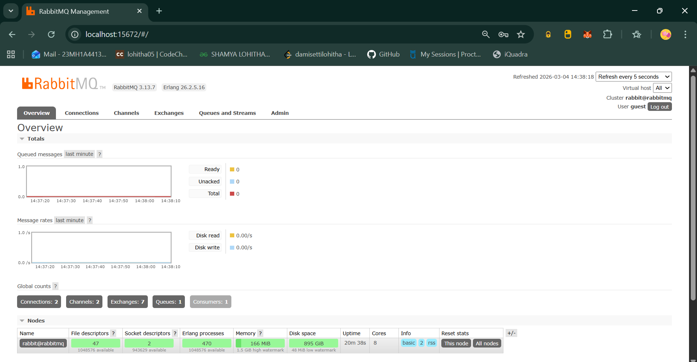
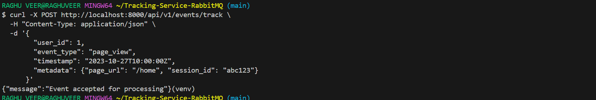
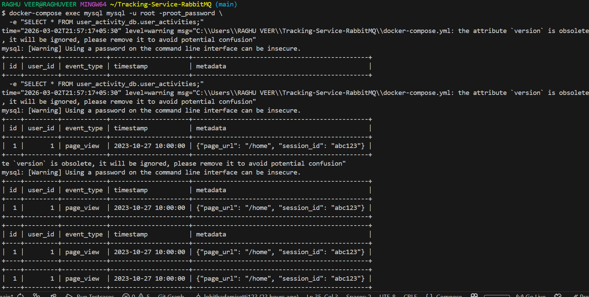
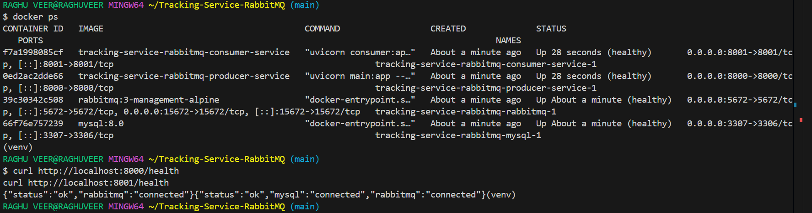
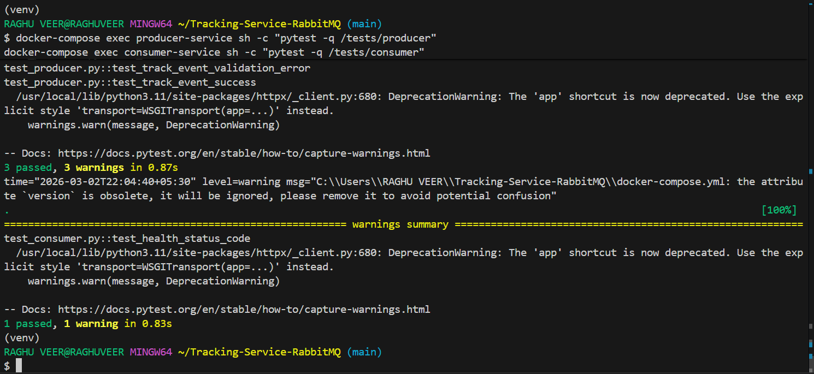

# Event-Driven User Activity Tracking Service (RabbitMQ + FastAPI + MySQL)

This project implements an **event-driven user activity tracking system** using a **Producer API** and a **Consumer service** communicating via **RabbitMQ**, with events persisted to **MySQL**. 

It is built to showcase skills in backend development, event-driven architecture, asynchronous processing, containerization with Docker Compose, and automated testing. 

***

## Architecture Overview

The system consists of four main components: 

- **Producer Service (FastAPI)**: Exposes `POST /api/v1/events/track` to receive user activity events and publish them to RabbitMQ.
- **Consumer Service (FastAPI)**: Subscribes to the `user_activity_events` queue, processes events, and writes them to MySQL.
- **RabbitMQ**: Message broker for decoupled, asynchronous communication.
- **MySQL**: Stores processed user activity records in `user_activities` table.

### High-Level Flow

1. Client calls `POST /api/v1/events/track` on Producer with a `UserActivityEvent` payload.
2. Producer validates the payload and publishes it to RabbitMQ (`user_activity_events` queue).
3. Consumer listens on the queue, consumes messages, deserializes them, and inserts them into MySQL.
4. Both Producer and Consumer expose `GET /health` endpoints for health checks and Docker Compose orchestration. 

## Tech Stack and Key Decisions

- **Language**: Python 3.11
- **Frameworks**: FastAPI for both Producer and Consumer HTTP endpoints.
- **Message Broker**: RabbitMQ (direct exchange, queue `user_activity_events`).
- **Database**: MySQL 8.0 with a single `user_activities` table.
- **Containerization**: Docker + Docker Compose to run all services with one command.
- **Testing**: `pytest` executed inside containers via `docker-compose exec ...` to match evaluation requirements. 
The Producer does **not** touch the database directly to avoid tight coupling; all persistence is done in the Consumer based on events from the queue.
***

## Project Structure

```text
.
├── producer-service/
│   ├── Dockerfile
│   ├── requirements.txt
│   └── src/
│       ├── main.py                # FastAPI app, /api/v1/events/track, /health
│       └── producer_service_app.py
├── consumer-service/
│   ├── Dockerfile
│   ├── requirements.txt
│   └── src/
│       └── consumer.py            # Consumer worker + /health
├── db/
│   └── init.sql                   # Creates user_activity_db.user_activities
├── tests/
│   ├── producer/
│   │   └── test_producer.py
│   └── consumer/
│       └── test_consumer.py
├── docker-compose.yml
├── .env.example
└── README.md
```

The `tests/` directory is mounted into containers via Docker Compose so tests can run with `docker-compose exec ...` as required. 

***

## Environment Variables

All sensitive or environment-specific configuration is driven via environment variables and documented in `.env.example`. 
Typical values:

```env
# RabbitMQ
RABBITMQ_HOST=rabbitmq
RABBITMQ_PORT=5672
RABBITMQ_USER=guest
RABBITMQ_PASSWORD=guest

# MySQL
MYSQL_HOST=mysql
MYSQL_PORT=3306
MYSQL_USER=root
MYSQL_PASSWORD=root_password
MYSQL_DB=user_activity_db

# Producer
PRODUCER_PORT=8000

# Consumer
CONSUMER_PORT=8001
```

Copy `.env.example` to `.env` and adjust if needed:

```bash
cp .env.example .env
```

***

## Setup and Running with Docker Compose

### Prerequisites

- Docker
- Docker Compose
- Git

### 1. Clone the Repository

```bash
git clone https://github.com/lohithadamisetti123/Tracking-Service-RabbitMQ.git
cd Tracking-Service-RabbitMQ
```

### 2. Start All Services

```bash
docker-compose up --build
```

This will:

- Build `producer-service` and `consumer-service` images.
- Start `rabbitmq` with the management UI on `http://localhost:15672`.
- Start `mysql` with `user_activity_db` initialized via `db/init.sql`.
- Expose:
  - Producer at `http://localhost:8000`
  - Consumer at `http://localhost:8001` 

Services include health checks to ensure dependencies are ready before starting.

***

## API Endpoints

### Producer Service (FastAPI)

Base URL: `http://localhost:8000`

#### Health Check

- **Method**: `GET`
- **Path**: `/health`
- **Response**: `200 OK` when app is running and able to talk to RabbitMQ. 

Example:

```bash
curl http://localhost:8000/health
```

#### Track User Activity Event

- **Method**: `POST`
- **Path**: `/api/v1/events/track`
- **Request Body (JSON)**:

```json
{
  "user_id": 123,
  "event_type": "page_view",
  "timestamp": "2023-10-27T10:00:00Z",
  "metadata": {
    "page_url": "/products/item-xyz",
    "session_id": "abc123"
  }
}
```

- **Success Response**: `202 Accepted`
- **Validation Error**: returns `422 Unprocessable Entity` (FastAPI body validation), or `400 Bad Request` for custom validation errors inside the handler. 

Example:

```bash
curl -X POST http://localhost:8000/api/v1/events/track \
  -H "Content-Type: application/json" \
  -d '{
        "user_id": 123,
        "event_type": "login",
        "timestamp": "2023-10-27T10:00:00Z",
        "metadata": {"ip": "127.0.0.1"}
      }'
```

### Consumer Service (FastAPI)

Base URL: `http://localhost:8001`

#### Health Check

- **Method**: `GET`
- **Path**: `/health`
- **Response**: `200 OK` when app is running and can connect to both RabbitMQ and MySQL.

Example:

```bash
curl http://localhost:8001/health
```

***

## Database Schema

The MySQL database is automatically initialized via `db/init.sql` when the `mysql` container starts. 

```sql
CREATE TABLE IF NOT EXISTS user_activities (
    id INT AUTO_INCREMENT PRIMARY KEY,
    user_id INT NOT NULL,
    event_type VARCHAR(50) NOT NULL,
    timestamp DATETIME NOT NULL,
    metadata JSON
);
```

You can inspect records with:

```bash
docker-compose exec mysql mysql -u root -proot_password -e "SELECT * FROM user_activity_db.user_activities;"
```

***

## Testing

Tests are executed **inside** the running service containers and use the mounted `/tests` directory. 
### Start services (if not already running)

```bash
docker-compose up --build -d
```

### Run Producer Tests

```bash
docker-compose exec producer-service sh -c "pytest -q /tests/producer"
```

### Run Consumer Tests

```bash
docker-compose exec consumer-service sh -c "pytest -q /tests/consumer"
```

All tests should pass before submission.

***

## Error Handling and Resilience

- **Producer**:
  - Validates request body using FastAPI/Pydantic.
  - Returns informative error messages for invalid payloads (missing fields, wrong types).
  - Publishes to RabbitMQ and returns `202` without blocking on consumer processing. 

- **Consumer**:
  - Continuously listens to the queue.
  - Handles malformed messages and DB errors with logging and does not crash on a single bad message.
  - Uses acknowledgements to avoid losing messages; failures are logged and can be extended to dead-letter queues as a future enhancement. 

Both services handle graceful shutdown (e.g., SIGTERM) to close connections and stop consuming cleanly. 

***

## Screenshots
### RabbitMQ Queue



### Producer Track Event



### MySQL user_activities Table



### Health Endpoints



### Tests Producers & Consumers



***

## Demo Video

Record a short demo (2–5 minutes) walking through:

1. Running `docker-compose up --build`.
2. Hitting `GET /health` for both services.
3. Sending a `POST /api/v1/events/track` request.
4. Showing the event in RabbitMQ.
5. Showing the persisted record in MySQL. [app.partnr](https://app.partnr.network/global-placement-program/tasks/3410709d18e5429fa230)

Upload the video (e.g., YouTube unlisted, Google Drive) and link it here:

```markdown
### Demo Video

Watch the demo video here: https://your-demo-video-link
```

***

## Challenges and Learnings

- Designing a **decoupled** Producer/Consumer pattern where the API does not depend on the database forced clear separation of concerns.
- Handling **asynchronous processing** and ensuring no message loss required careful handling of acknowledgements and error paths in the Consumer. ker-compose exec <service> <test-command>` highlighted the importance of container-friendly testing strategies and volume mounts. 

